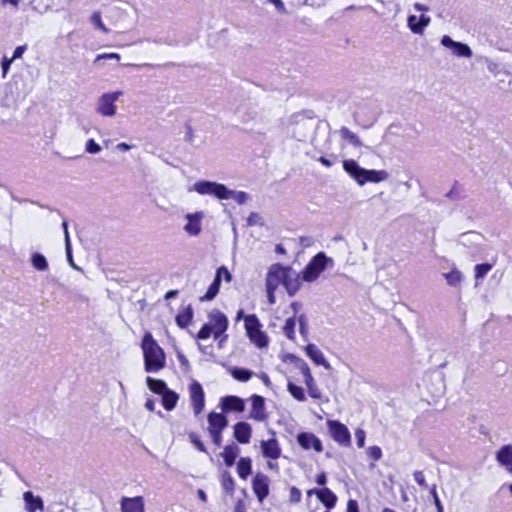
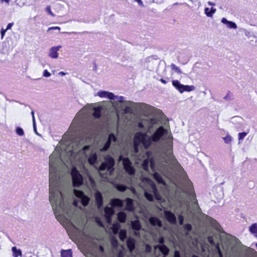

# 🫀 biopsy

This repository contains a Python package, **biopsy**, for preprocessing OpenSlide image
files (`.ndpi` files) and their corresponding annotations (`.ndpa` files) for use with
Machine Learning segmentation models. The package serves three main purposes:

1. Since the OpenSlide image files are often very large, it's not possible to build
   Machine Learning models that process the entire full resolution image at once.
   Instead, the original image can be divided into smaller *tiles* each of which can
   then be fed to the Machine Learning model separately.
2. When training a segmentation model, an image that defines the segments is required.
   This is called the *mask* and it would be the *expected output* that the model would
   learn to output given a tile. The `.ndpa` files are XML files which define the
   segments as points and lines between them. The biopsy package can, for every tile
   that it creates, create a corresponding mask image from the `.ndpa` file.
3. Finally, the package can handle very basic image augmentation by rotating the tiles
   and corresponding masks.

Below is an example showing a tile and its corresponding mask. Finally, just for
illustration, the mask is shown pasted onto the original tile to show how they line up.

|             |                   |     |
|:-------------:|:-------------:|:-----:|
|       |  |  |
| Tile        | Mask           | Mask on tile  |

## Prerequisites

Before you can use the biopsy package, you need to install OpensSide. Since OpenSlide is
not a python package, it is *not* installed automatically when installing biopsy.
Instructions for installing OpenSlide can be found here at
<https://openslide.org/download/>. If you're on a Mac, you can install OpenSlide using
[Homebrew](https://brew.sh) as follows:

```zsh
brew install openslide
```

## Installation

```zsh
pip3 install -e .
```

## Usage

After installing biopsy, you can run it from the the command-line as follows:

```zsh
biopsy preprocess INPUT_FOLDER OUTPUT_FOLDER
```

The command will find all `.ndpi` files in the specified `INPUT_FOLDER` which have a
corresponding `.ndpa` file and create tile images and mask images in the specified
`OUTPUT_FOLDER`.

In addition to the two positional arguments mentioned above, you can also specify
optional arguments:

* `-h` or `--help`: Show help message.
* `-l LEVEL` or `--level LEVEL`: Zoom level to use for extraction of images from slides.
  Defaults to 2.
* `-s TILE_SIZE` or `--tile-size TILE_SIZE`: Size of output tiles in pixels. Defaults to
  512.
* `-o OVERLAP` or `--overlap OVERLAP`: Fraction of image to overlap tiles. Defaults to
  0.0.
* `--rotate`: Create augmented images by rotating the original images.

Alternatively, you can run the Jupyter notebook named **Preprocess** located in the
**notebooks** folder.

## Known Issues

For this package to be useful, the following needs to be implemented:

1. Some kind of segmentation model, possibly a UNet, that can be trained on the
   generated images.
2. Some way to convert segmenations created by the segmentation model to `.ndpa`
   files to allow them to be loaded back into the slide viewer / editor software.

## Further reading

* For some hints on how to interpret the `.ndpa` files, see:
  <https://openslide-users.andrew.cmu.narkive.com/bouE1LwV/nanozoomer-annotation-coordinate-system-to-openslide-pixels>.

